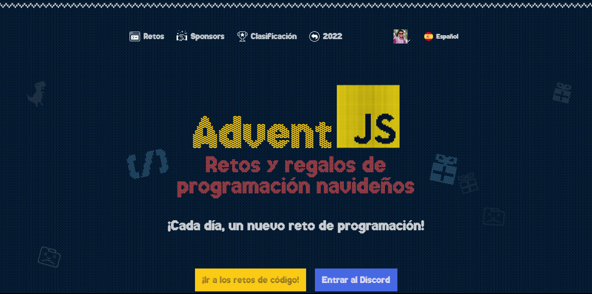

# Advent JS - 2023

En este repositorio estaré subiendo mi resolución a los retos del AdventJS 2023, además de los tests que fueron empleados para comprobar la solución a cada uno de los ejercicios implementados tanto en JavaScript como en TypeScript.

Si quieres practicar y resolver los retos por tu cuenta, entra a [Advent JS](https://adventjs.dev/es)



##  <strong> [AdventJS](https://adventjs.dev/es) es una iniciativa de [@midudev](https://midu.dev/)</strong>

## Retos
---

| Reto  | Titulo    | Solución  | Dificultad[^1]    |
| ----- | --------- | --------- | ----------------- |

[^1]: **Dificultad**: 🟢 Fácil 🟠 Media 🔴 Difícil 🟣 Muy Difícil

## Instalación

Clona este repositorio usando:

```bash
git clone https://github.com/chicho69-cesar/adventJS-2023.git
```

Instala Jest para realizar los tests de los retos:

```bash
npm install jest, @types/jest
```

## Tests

Puedes comprobar todos los tests de los retos usando el comando:

```bash
npm run jest
```

O También puedes ejecutar los siguientes comandos, para ejecutar tanto todos los tests como los tests individuales de cada reto:

```bash
npm run test # Para correr todos los test de todos los retos
npm run test:n # n siendo el numero del reto, por ejemplo
npm run test:1 # Correrá el test del reto 1
```
